Patterns of Gene Expression in Early Developing Complex Leaves
========================================================
author: Ciera Martinez
date: September 8, 2014
font-family: 'Baskerville'
css:cieraSlides.css

Background
========================================================
title: FALSE

  

Background
========================================================
title: False

  
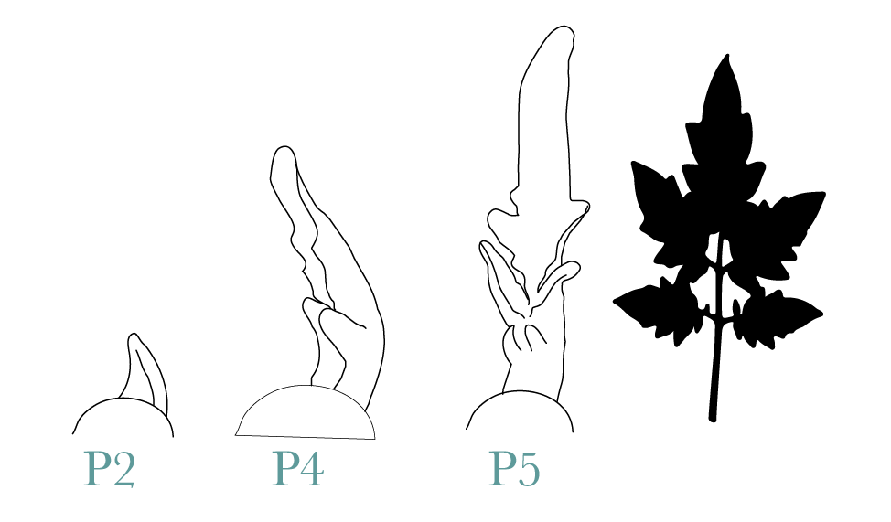

Background
========================================================
left: 60%
title: false

***

**Pattern 1**: Tip to base wave of differentiation (basipetal).  
Cell differentation occurring first at the tip.

**Pattern 2**: Marginal  blastozone or marginal meristem, is 
defined histologically as having dense cells and 
maintenance of high rates of cell division.

Main Question
========================================================
  
What are the genes expression trends observed in early complex leaf 
development that would explain differentiation patterning in the leaf?

Approach 
========================================================
left: 60%

***
Isolate tissue 

**1**. longitudinal 
axis (tip, mid, base)

**2**. margins compared with all other tissue 
(rachis  and midvein) regions, to perform gene expression analysis.

Laser Capture Microdissection
========================================================

<video width="1000" controls="controls">
<source src="movies/LCMmovie.m4v" type="video/mp4">
</video>

DE & GO enrichment
========================================================

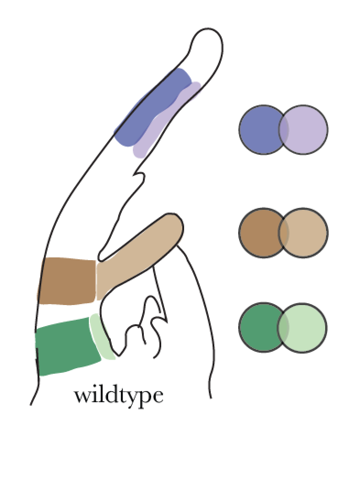

DE & GO enrichment
========================================================

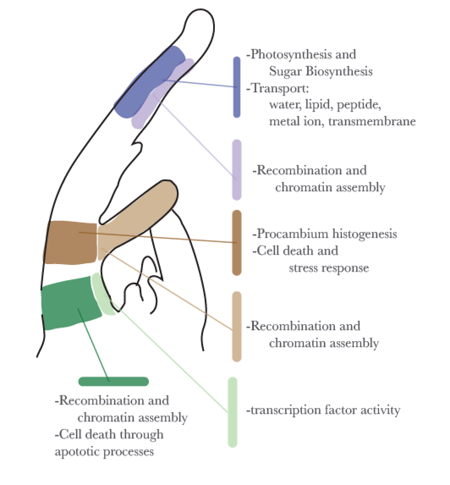

DE & GO enrichment
========================================================

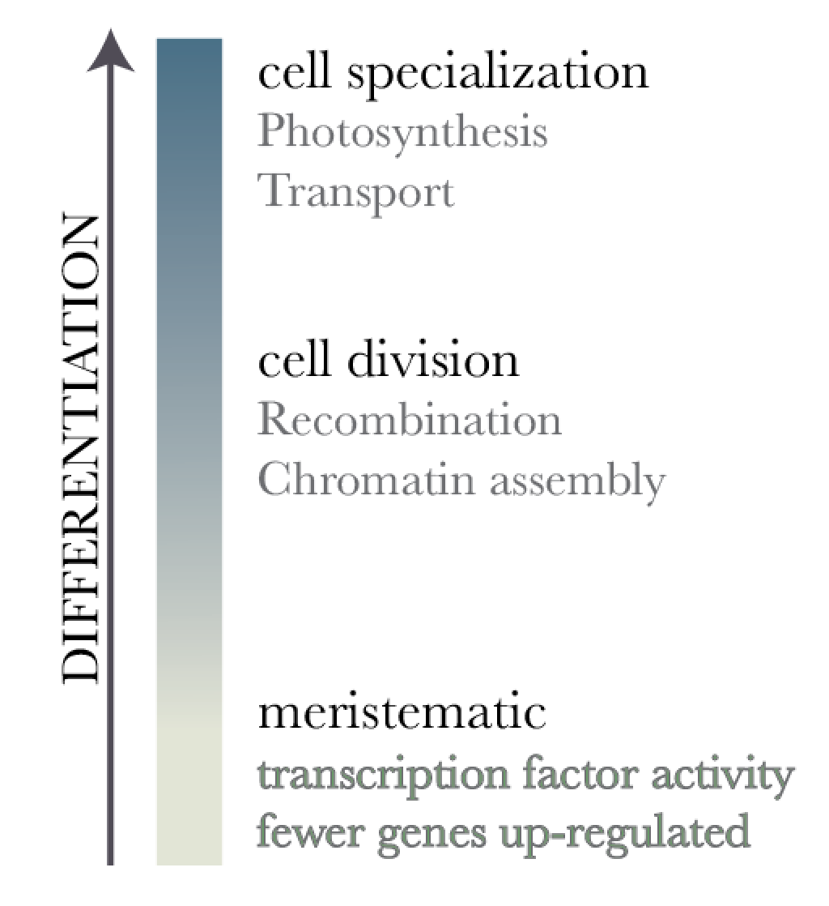

***

  
**Conclusion**

Genes that are up-regulated
in each tissue type compared to the 
other  in same region reflect 
cell differentiation patterning. 

Photosynthetic Activity
========================================================

Photosynthetic Activity
========================================================
left: 30%

***

**Question**:  In which regions and at what developmental stage 
is  photosynthetic activity first evident in early developing leaves?

Photosynthetic Activity
========================================================
left: 30%

***

**Approach**: Chlorophyll a/b binding protein (CAB)::GUS  
localization reflects photosynthetic activity.

Photosynthetic Activity
========================================================
left: 30%

***

**Approach**: Chlorophyll a/b binding protein (CAB)::GUS  
localization reflects photosynthetic activity.

Ubiquitous in mature leaves.  

Photosynthetic Activity
========================================================

Photosynthetic Activity
========================================================
 
**Conclusions 1**: Early in leaf development (P4 & P5), the rachis 
and midviein show CAB activity, suggesting these regions are
first to start specialized processes such as photosynthesis. 

**Conclustion 2**: The LCM approach for determining gene expression 
patterns is capable of predicting verifiable expression patterns!

Co-expression Analysis 
========================================================

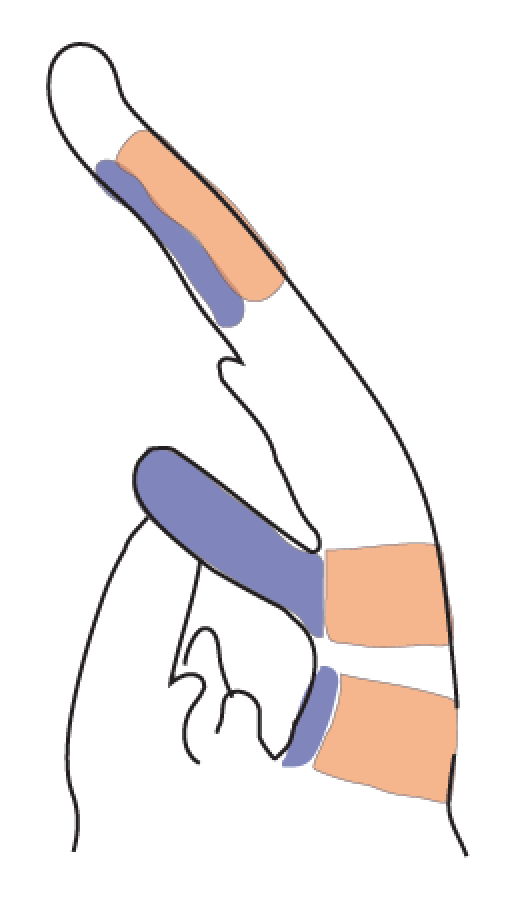

***

**Question 1**: Does clustering give similar GO enrichment 
results  to DE analysis?

**Question 2**: Are there patterns of gene expression that 
explain margin/rachis identity?

**Question 3**:  Can we get to single interesting genes that 
may explain differentiation patterning by subsetting to a 
finer scale?

Subset Normalized read count
========================================================

There are two choices to subset the data:

1. Get list of all genes that are significantly differentially expressed from all DE analysis: 3580 unique genes
2. Top 25% co-efficient of variation: 4618 unique genes.

Subset Normalized read count
========================================================

## 25% co-efficient of variation

1. Most genes are in both
2. Longer.
3. More Direct
4. Similar results from both analyses can be added evidence for robustness of conclusions. 

Principle Component Analysis
========================================================
left: 50%

 

PC1 (29.2%)  

PC2 (20.8%) 
***
 
 
PC3 (20.3%) 

PC4 (15.6%)

Self Organizing Maps  
========================================================

   
Groups genes with similar expression patterns to clusters 
or nodes. 

Results have been found to be similar to both k-means 
clustering (Chitwood et al., 2013),but allow greater 
handling of data in levels, for instance between
species or genotypes. 

Self Organizing Maps - SMALL (3,2)
========================================================

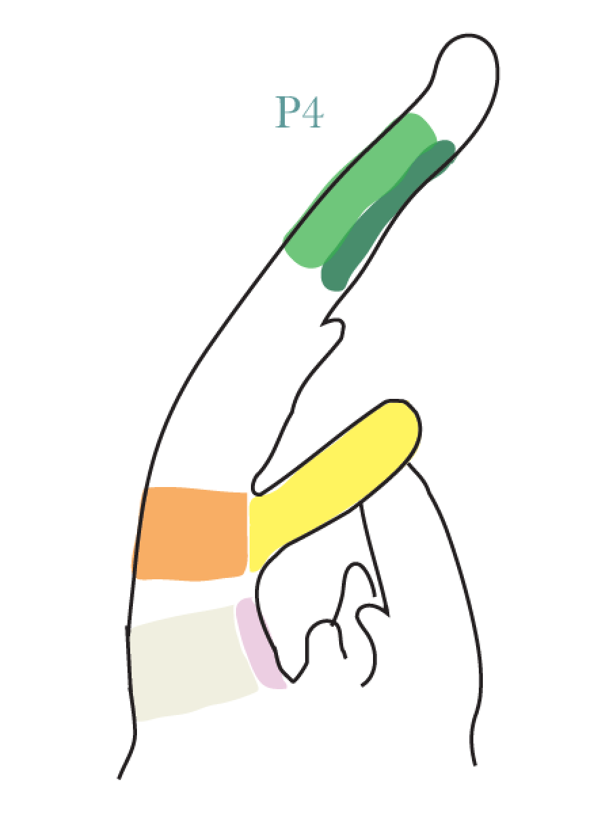

***

 

Self Organizing Maps - SMALL (3,2)
========================================================
title:FALSE

 
***
 

Cluster 2 
========================================================

 

***

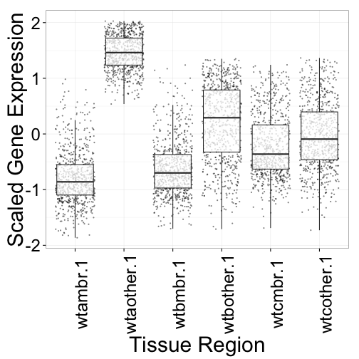 

Cluster 2 - Photosynthetic GO categories
========================================================

***

**GO Categories**

- heme binding                   
- oxygen binding                  
- photosynthesis, light harvesting
- apoptotic process  

**Question 1**: Does clustering give similar GO enrichment 
results to DE analysis?

Yes. Recapitulates DE expression patterns in tissue 
specific regions.

========================================================
  

**Question 2:** What are the specifc genes that contribute to marginal idenity?

Self Organizing Maps - Large (6,6)
========================================================

 

Cluster Specific Analsysis Example 
========================================================
left: 30%

***

 

Cluster 17: Up-regulated in rachis compared to margin tissue within each region 

Cluster 17: Growth Genes
========================================================
left: 80%

<small>Auxin Response 6 - auxin response via expression of auxin regulated genes

gibberellin 2-oxidase - responsive to cytokinin and KNOX activities

ARGONAUTE7 - required for mediolateral expansion in maize (Douglas et al, 2010)

REDUCED STEM BRANCHING 6 - MADS-box transcription factor, mutant flower margins expanded (TAIR mutant lines)

AP2/B3 domain transcription factor - may function as a negative growth regulator

R2R3-MYB TF factor gene -  MYB gene involved in cell fate idenity & Lateral Meristem Initiation (Muller et al., 2005)

EMBRYO DEFECTIVE - mutant with enlarged SAM (Cushing et al. 2005)</small>

Cluster 35
========================================================
left: 30%

***

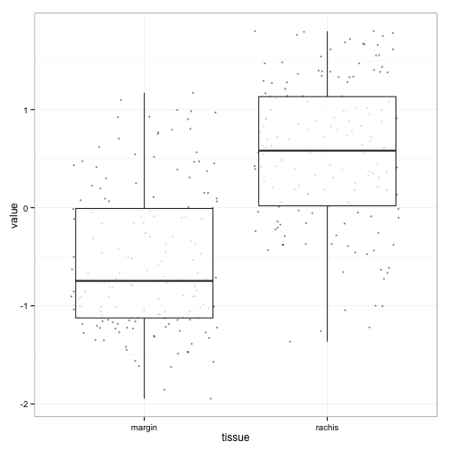 

Cluster 35 - Photosynthesis and Vascular Differentiation
========================================================
<small>**Solyc00g277510** - Encodes chlorophyll binding protein D1, a part of the photosystem II reaction center core

**Solyc02g071000** - Subunit of light-harvesting complex II (LHCII),which absorbs light and transfers energy to the photosynthetic reaction center.

**Solyc05g013570** - phototropic-responsive NPH3 family protein

**Solyc05g041230** - chloroplast gene encoding a CP43 subunit of  the photosystem II reaction center.

**Solyc08g066500** - Member of the class III HD-ZIP protein family. Critical for vascular development.

**Solyc08g067330** - Encodes lhcb1.1 a component of the LHCIIb light harvesting complex associated with photosystem II.</small>

Further investigation using mutant with accelerated cellular differentiation
========================================================

========================================================
left: 70%

***

  
Mutant is unable to maintain proper auxin foci due to low PIN1 
expression levels

========================================================

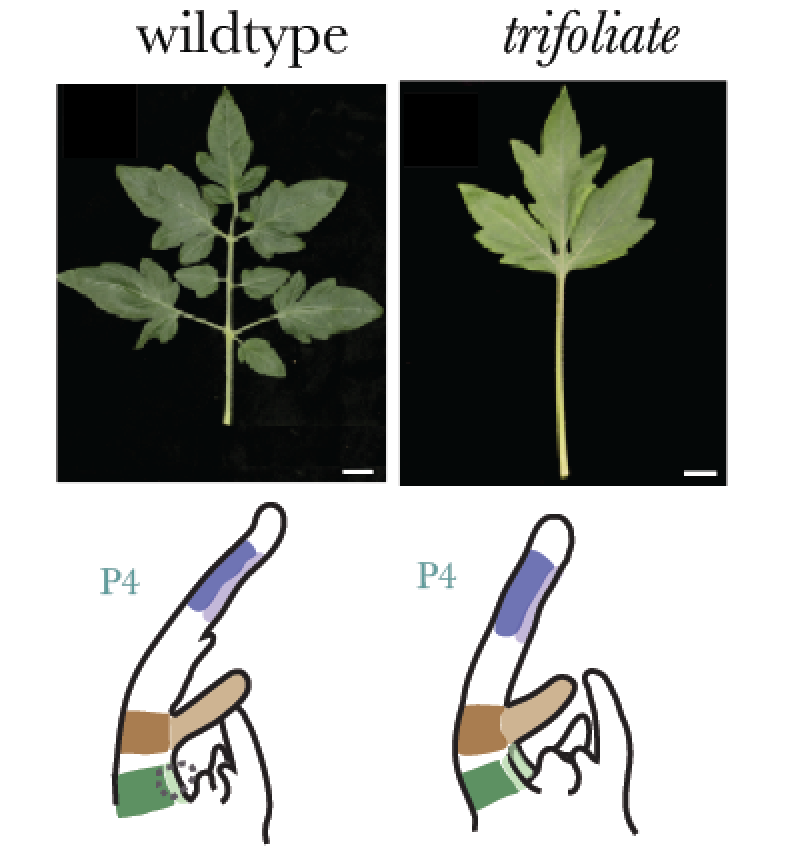

*trifoliate* mutant is unable to make leaflets in response to exogenous
auxin applications, indicating lack of competence in the 
primordium.

Basic Vs. Super Self Organized Maps
========================================================
  
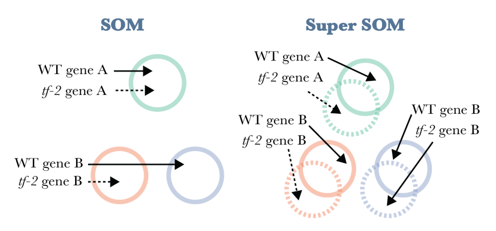

Basic SOM Small - Rachis & Tip up-regulated genes
========================================================
left:30%

***

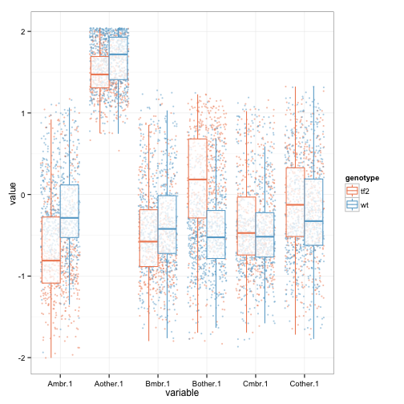 

Basic Organized Maps
========================================================
 

***

- GO enrichment reflects previous DE expression: in this case photosythetic enriched.
- We can go further by looking into what sorts of genes are similar & different between the groups, to try to understand further how these genotypes are differently regulated. 

Basic Organized Maps
========================================================
 

***

- GO enrichment reflects previous DE expression: in this case photosythetic enriched.
- We can go further by looking into what sorts of genes are similar & different between the groups, to try to understand further how these genotypes are differently regulated. 

Basic Organized Maps - Margin at Base 
========================================================
left:30%

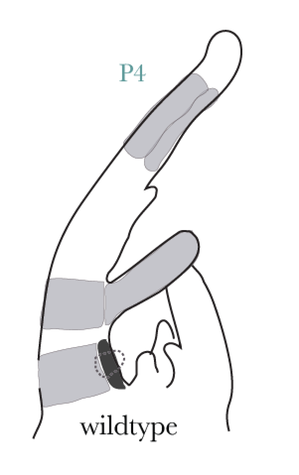
***
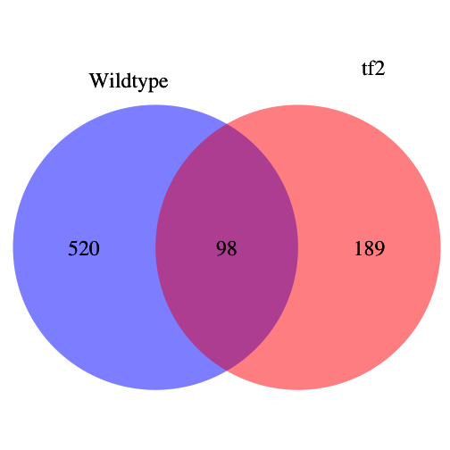 

Basic Organized Maps - Margin at Base 
========================================================
left:30%

***
- GO sequence-specific DNA binding transcription factor activity & transcription factor complex

- *tf2* specific includes developmental genes YABBY, KNAT6, ARF8, SCARECROW

- WT specific includes NAC transcription factor

**Still too many genes!**

Future : Need to look at larger SOMs for more refined co-expression patterns. 

Super Organized Maps
========================================================

Super SOM: clusters have dimensionality and a separate 
identity associated with genotype data set, but ultimately, 
data must be assigned to the same cluster.

Super Organized Maps
========================================================

SuperSOM - Cluster 12
========================================================

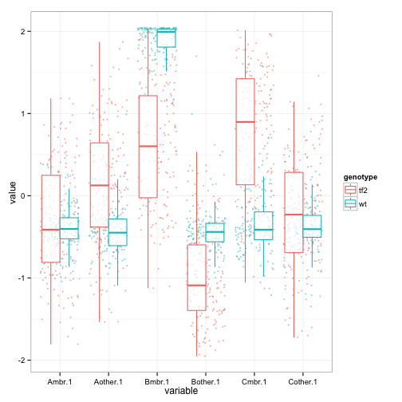 

***

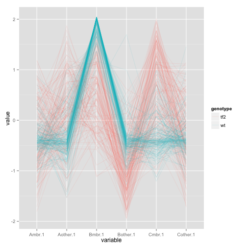 

SuperSOM - Cluster 12
========================================================

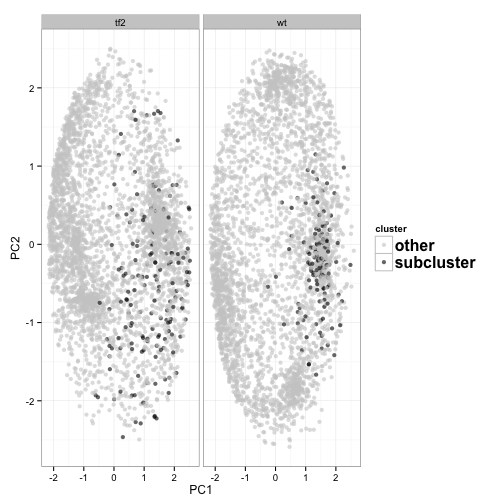 

***

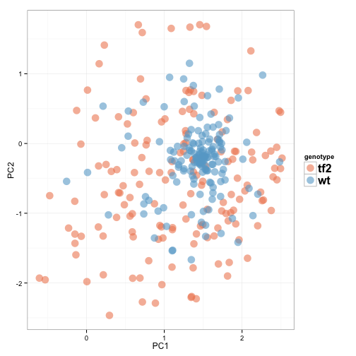 

SuperSOM - Cluster 12
========================================================

<H3>Auxin Regulation and Transport</H3>

**Solyc12g006340.1.1 (ARF8)**:Encodes a member of the auxin response factor family.

**Solyc10g076790.1.1 (AUX1)**:  Encodes an auxin influx transporter.

**Solyc03g118740.2.1 (PIN1)**: Auxin efflux.

SuperSOM - Cluster 12
========================================================

<H3>Developmental Transciption Factors</H3>

**Solyc09g065820.2.1**:  DNA binding / transcription factor; cell differentiation.

**Solyc09g010780.2.1**:  Involved in leaf development. Knockout mutants have abnormally shaped leaves.

**Solyc02g080260.2.1**: Encodes a homeodomain protein that is expressed in the LI layer of the vegetative

**Solyc07g018290.2.1 (PLETHERA 1)**: expressed in young tissues and may specify meristematic or division-competent states. (Wilson et al., 2005).

**Solyc06g075850.1.1**: Histone H4 : cytochrome P450 monooxygenase. Expressed in cotyledons and leaves

**Solyc04g009950.2.1**: R2R3- type MYB- encoding genes

SuperSOM - Cluster 28
========================================================

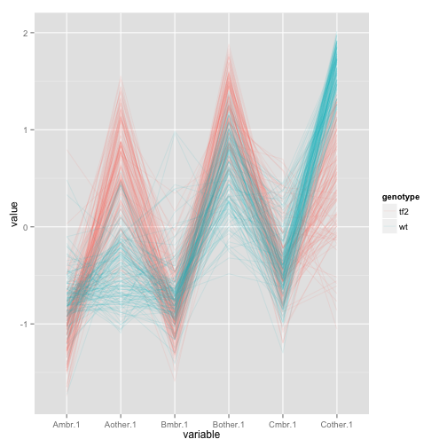 

SuperSOM - Cluster 28
========================================================

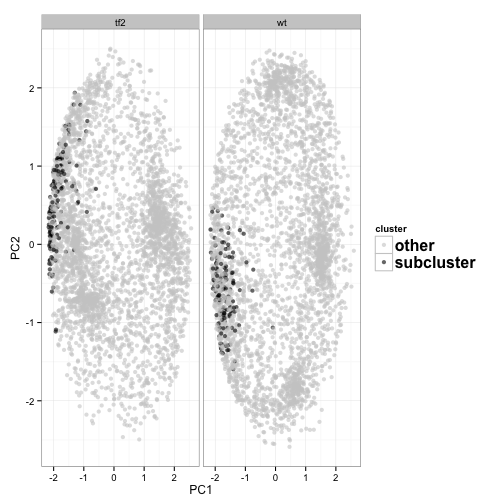 

***

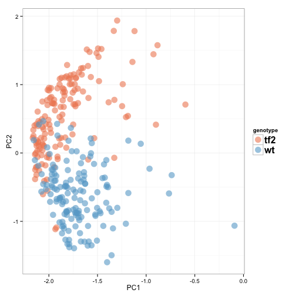 

Future
========================================================

- Look into SOMs a closer, identify possible canidates for 
functional work

- Network analysis to identify major hubs of developmental 
patterning
