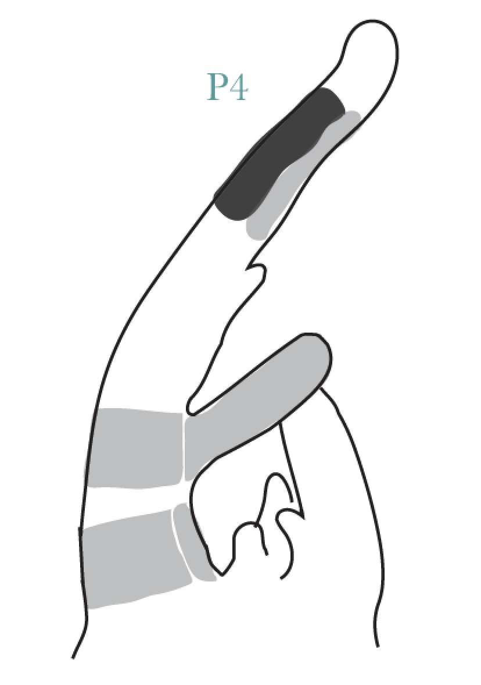

Pattern of Gene Expression in Early Developing Complex Leaves
========================================================
author: Ciera Martinez
date: September 8, 2014
font-family: 'Baskerville'
css:cieraSlides.css

Background
========================================================

Background
========================================================

***
text

Background
========================================================
left: 70%
title: false

***
text

Main Questions
========================================================

1.  What are the genes that 

Laser Capture Microdissection
========================================================

Image of LCM and regions

Laser Capture Microdissection
========================================================

<video width="1000" controls="controls">
<source src="movies/LCMmovie.m4v" type="video/mp4">
</video>

Differential Gene Expression & GO enrichment
========================================================

- EdgeR 
- Goseq

Differential Gene Expression & GO enrichment
========================================================

Subset Normalized read count
========================================================

There are two choices to subset the data:

1. Get list of all genes that are significantly differentially expressed from all DE analysis: 3580 unique genes
2. Top 25% co-efficient of variation: 4618 unique genes.

Subset Normalized read count
========================================================

## 25% co-efficient of variation

1. Most genes are in both
2. Longer.
3. More Direct
4. Similar results from both analyses can be added evidence for robustness of conclusions. 

Principle Component Analysis
========================================================
left: 50%

 
***
 

Co-expression analysis 
========================================================

Group similar expression patterns to each other. 

Self Organizing Maps 
========================================================

Self Organizing Maps - SMALL (3,2)
========================================================
title:FALSE

***

 

Self Organizing Maps - SMALL (3,2)
========================================================
title:FALSE

 
***
 

Cluster 2 
========================================================

 

***

 

Cluster 2 
========================================================

***

**GO Categories**

- heme binding                   
- oxygen binding                  
- photosynthesis, light harvesting
- apoptotic process    

Self Organizing Maps - Large (6,6)
========================================================

 

