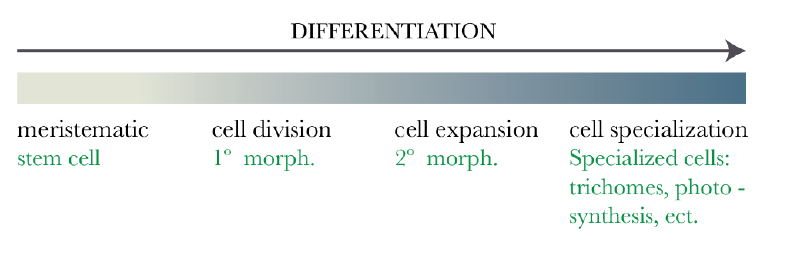
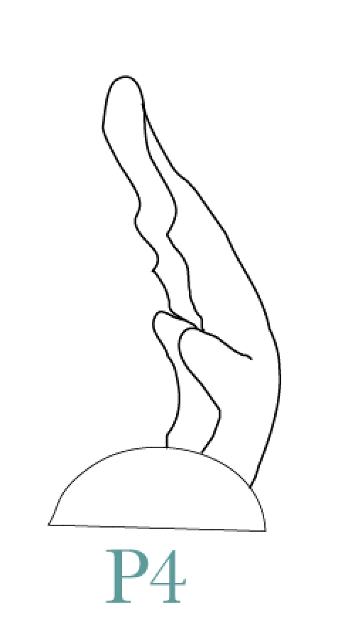
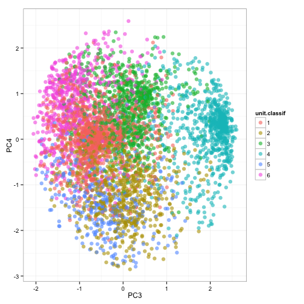
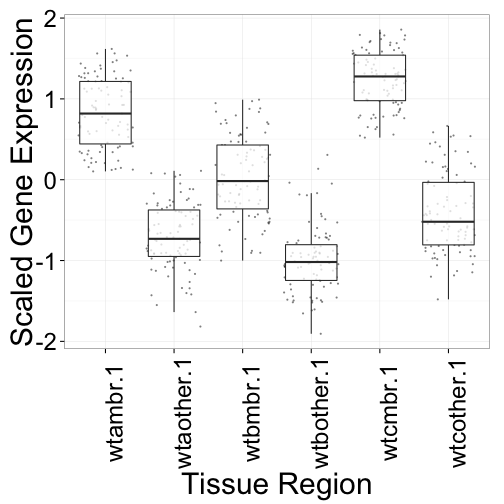

Pattern of Gene Expression in Early Developing Complex Leaves
========================================================
author: Ciera Martinez
date: September 8, 2014
font-family: 'Baskerville'
css:cieraSlides.css

Background
========================================================

Background
========================================================

***
text

Background
========================================================
left: 70%
title: false

***
text

Main Questions
========================================================

1.  What are the genes that 

Laser Capture Microdissection
========================================================

Image of LCM and regions

Laser Capture Microdissection
========================================================

<video width="1000" controls="controls">
<source src="movies/LCMmovie.m4v" type="video/mp4">
</video>

Differential Gene Expression & GO enrichment
========================================================

- EdgeR 
- Goseq

Differential Gene Expression & GO enrichment
========================================================

Subset Normalized read count
========================================================

There are two choices to subset the data:

1. Get list of all genes that are significantly differentially expressed from all DE analysis: 3580 unique genes
2. Top 25% co-efficient of variation: 4618 unique genes.

Subset Normalized read count
========================================================

## 25% co-efficient of variation

1. Most genes are in both
2. Longer.
3. More Direct
4. Similar results from both analyses can be added evidence for robustness of conclusions. 

Principle Component Analysis
========================================================
left: 50%

 
***
 

Co-expression analysis 
========================================================

Group similar expression patterns to each other. 

Self Organizing Maps 
========================================================

Self Organizing Maps - SMALL (3,2)
========================================================
title:FALSE

***

 

Self Organizing Maps - SMALL (3,2)
========================================================
title:FALSE

 
***
 

Cluster 2 
========================================================

 

***

 

Cluster 2 
========================================================

***

**GO Categories**

- heme binding                   
- oxygen binding                  
- photosynthesis, light harvesting
- apoptotic process    

Questions of Co-expression
========================================================

What are the specifc genes that contribute to marginal idenity? 

Self Organizing Maps - Large (6,6)
========================================================

 

Cluster Specific Analsysis Example 
========================================================
left: 30%

***

 

Cluster 17: Up-regulated in rachis compared to margin tissue within each region 

Cluster 17: Growth Genes
========================================================
left: 80%

<small>Auxin Response 6 - auxin response via expression of auxin regulated genes

gibberellin 2-oxidase - responsive to cytokinin and KNOX activities

ARGONAUTE7 - required for mediolateral expansion in maize (Douglas et al, 2010)

REDUCED STEM BRANCHING 6 - MADS-box transcription factor, mutant flower margins expanded (TAIR mutant lines)

AP2/B3 domain transcription factor - may function as a negative growth regulator

R2R3-MYB TF factor gene -  MYB gene involved in cell fate idenity & Lateral Meristem Initiation (Muller et al., 2005)

EMBRYO DEFECTIVE - mutant with enlarged SAM (Cushing et al. 2005)</small>

Cluster 35
========================================================
left: 30%

***

 

Cluster 35 - Photosynthesis and Vascular Differentiation
========================================================
<small>**Solyc00g277510** - Encodes chlorophyll binding protein D1, a part of the photosystem II reaction center core

**Solyc02g071000** - Subunit of light-harvesting complex II (LHCII),which absorbs light and transfers energy to the photosynthetic reaction center.

**Solyc05g013570** - phototropic-responsive NPH3 family protein

**Solyc05g041230** - chloroplast gene encoding a CP43 subunit of  the photosystem II reaction center.

**Solyc08g066500** - Member of the class III HD-ZIP protein family. Critical for vascular development.

**Solyc08g067330** - Encodes lhcb1.1 a component of the LHCIIb light harvesting complex associated with photosystem II.</small>

Further investigation using mutant with accelerated cellular differentiation
========================================================

========================================================
left: 70%

***

  
Mutant is unable to maintain proper auxin foci due to low PIN1 
expression levels

========================================================
left: 70%

***

  
Mutant is unable to maintain proper auxin foci due to low PIN1 
expression levels

Self Organized Maps Vs. Super Self Organized Maps
========================================================

