Patterns of Gene Expression in Early Developing Complex Leaves
========================================================
author: Ciera Martinez
date: October 18, 2014
font-family: 'Baskerville'
css:cieraSlides.css

Background
========================================================
title: FALSE

</br></br>


Background
========================================================
title: False

</br></br>
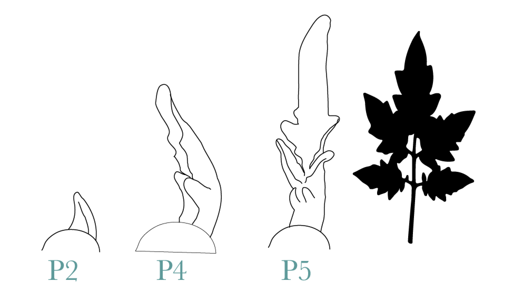

Background
========================================================
left: 60%
title: false

<br/><br/>
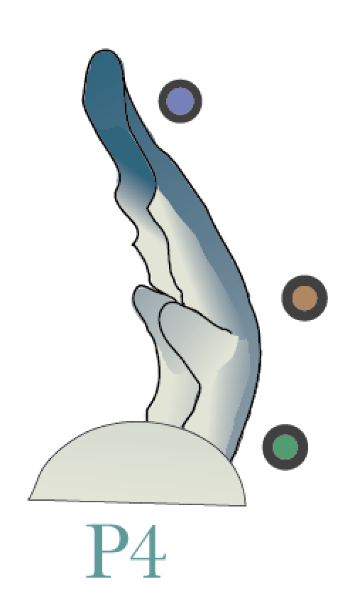

***
<br/><br/>
**Pattern 1**: Tip to base wave of differentiation.  
Cell differentation occurring first at the tip.

**Pattern 2**: Midrib to Marginal  blastozone or marginal meristem  
(defined histologically as having dense cells and 
maintenance of high rates of cell division)


Main Question
========================================================
</br></br>
What are the genes expression trends observed in early complex leaf 
development that would explain differentiation patterning in the leaf?


Approach 
========================================================
left: 60%

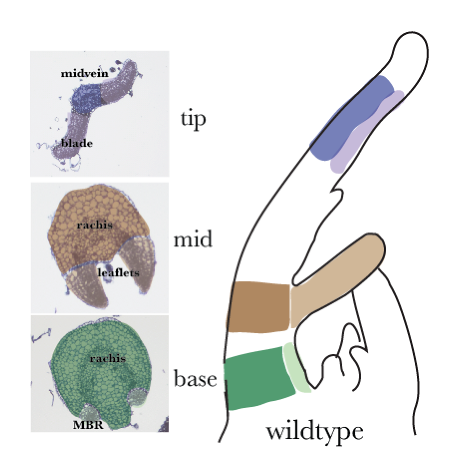
***
Isolate tissue 

**1**. longitudinal 
axis (tip, mid, base)

**2**. margins compared with all other tissue 
(rachis  and midvein) regions, to perform gene expression analysis.


Laser Capture Microdissection
========================================================

<video width="1000" controls="controls">
<source src="movies/LCMmovie.m4v" type="video/mp4">
</video>

DE & GO enrichment
========================================================

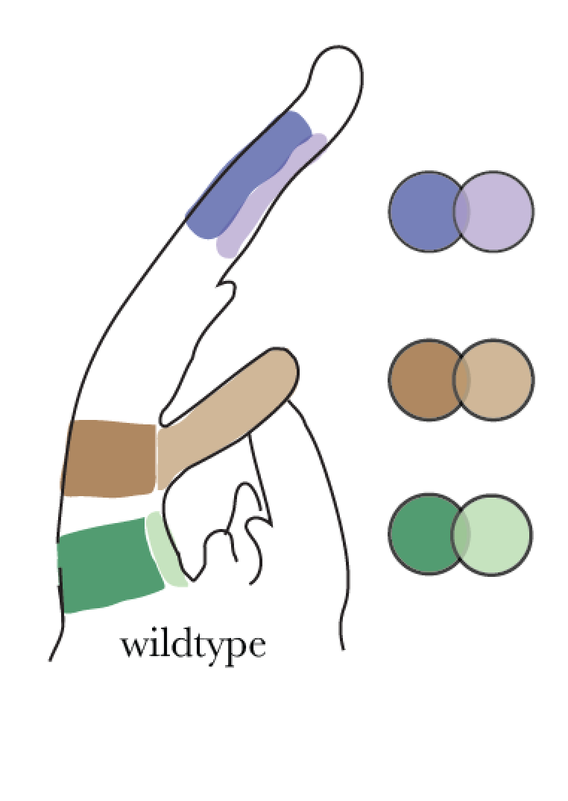

DE & GO enrichment
========================================================

<center>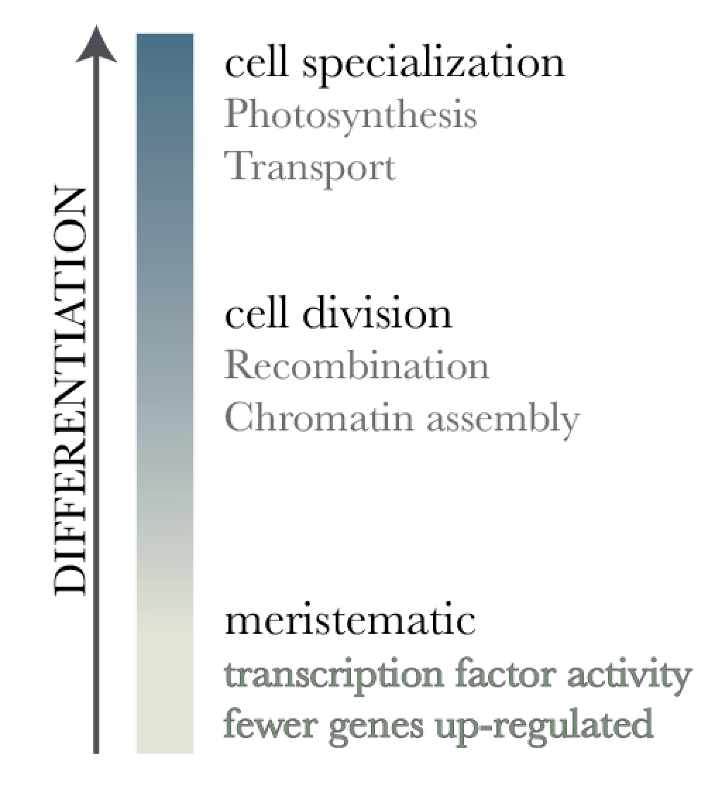</center>

***

</br></br>
**Conclusion**

The regions further along in development
 will have up-regulation of GO categories 
 associated with differentiated tissue. 

Photosynthetic Activity
========================================================

<center>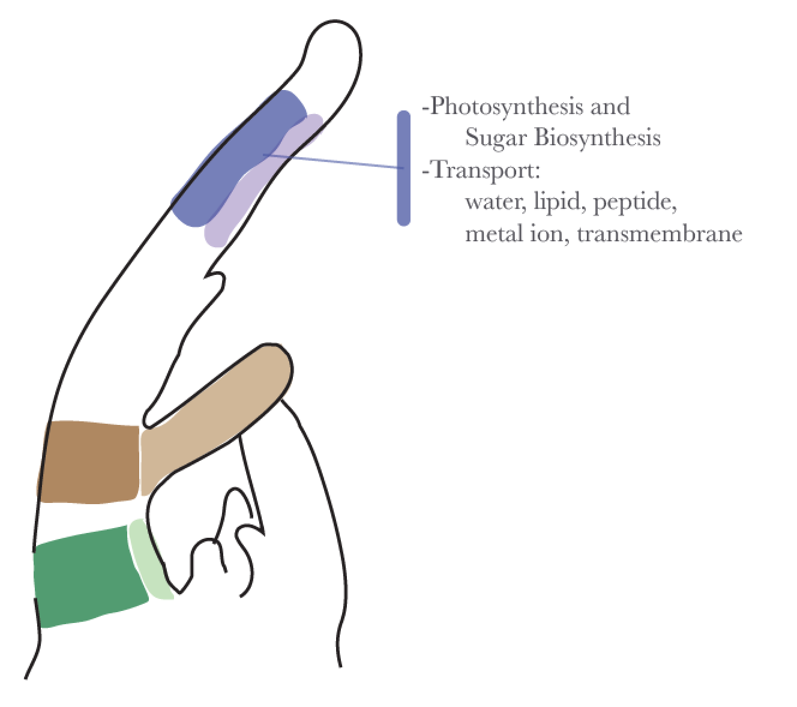</center>

Photosynthetic Activity
========================================================
left: 30%

<center>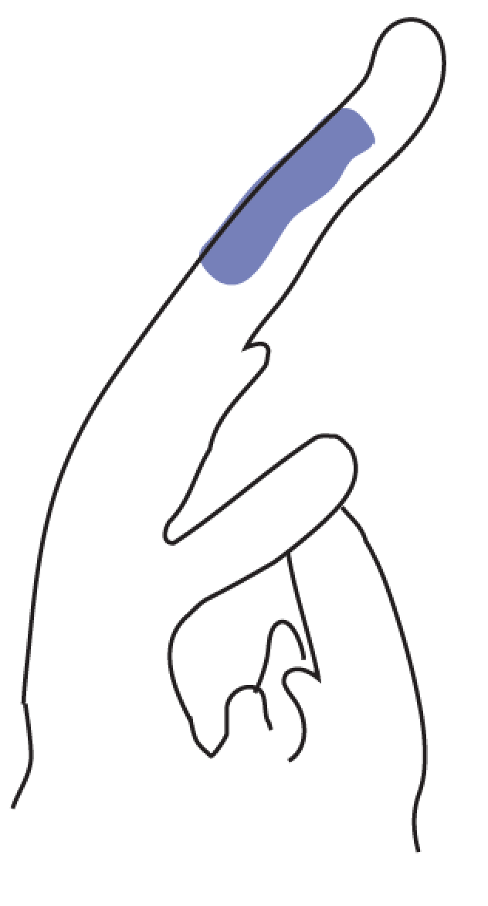</center>

***

It is unknown when and where photosynthetic activity is first evident in early developing leaves.


Photosynthetic Activity
========================================================
left: 30%

<center></center>

***

**Approach**: Chlorophyll a/b binding protein (CAB)::GUS  
localization reflects photosynthetic activity.

Photosynthetic Activity
========================================================
left: 30%

<center>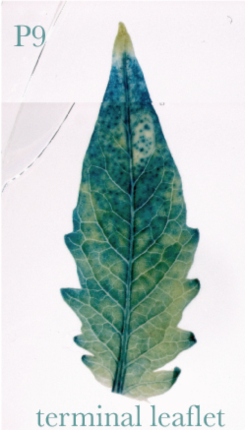</center>

***

**Approach**: Chlorophyll a/b binding protein (CAB)::GUS  
localization reflects photosynthetic activity.

Ubiquitous in mature leaves.  

Photosynthetic Activity
========================================================
left: 30%

<center></center>

***

**Approach**: Chlorophyll a/b binding protein (CAB)::GUS  
localization reflects photosynthetic activity.

Ubiquitous in mature leaves. 

Where does CAB localize early in leaf development?

Photosynthetic Activity
========================================================

<center>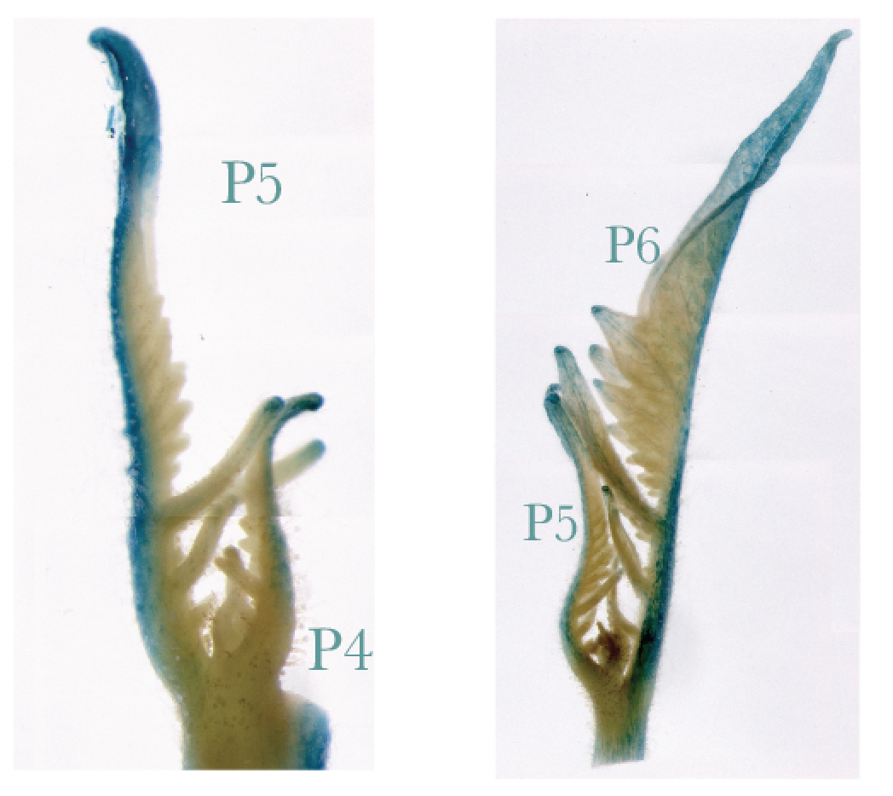</center>

Photosynthetic Activity
========================================================
</br>
**Conclusions 1**: Early in leaf development (P4 & P5), the rachis 
and midviein show CAB activity, suggesting these regions are
first to start specialized processes such as photosynthesis. 

**Conclustion 2**: The LCM approach for determining gene expression 
patterns is capable of predicting verifiable expression patterns.

Co-expression Analysis 
========================================================

<center>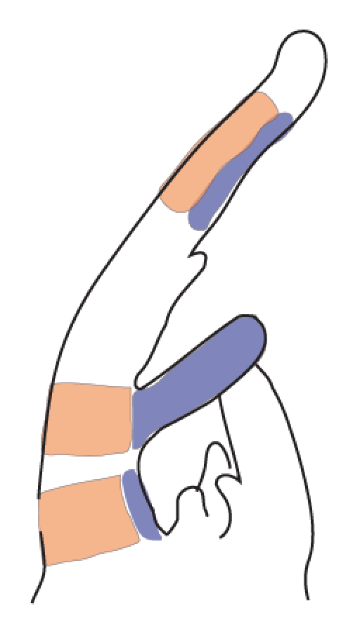</center>

***

**Question 1**: Does clustering give similar GO enrichment 
results  to DE analysis?

**Question 2**: Are there patterns of gene expression that 
explain margin/rachis identity?

**Question 3**:  Can we get to smaller subset of genes that 
may explain differentiation patterning during leaf development?

Principle Component Analysis
========================================================
left: 50%

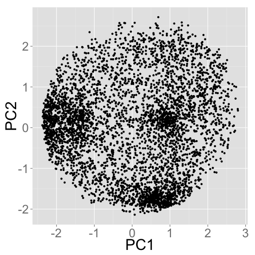 

PC1 (29.2%)  

PC2 (20.8%) 
***
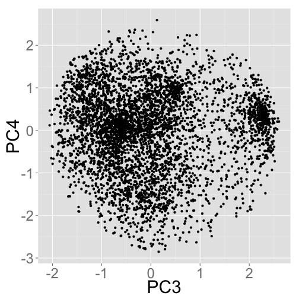 
</br>
PC3 (20.3%) 

PC4 (15.6%)

Self Organizing Maps  
========================================================

</br></br> 
Group genes with similar expression patterns to clusters 
or nodes. 

***

</br></br> 
Explain what SOM better. 

Self Organizing Maps: Limit to six clusters
========================================================

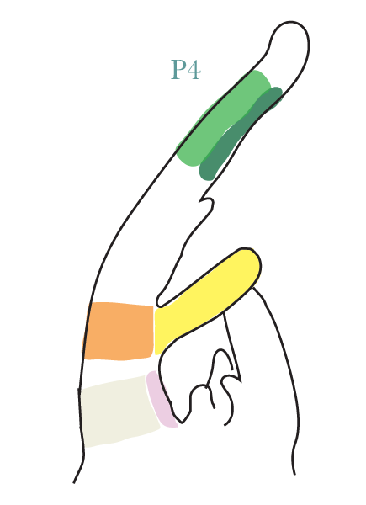

***

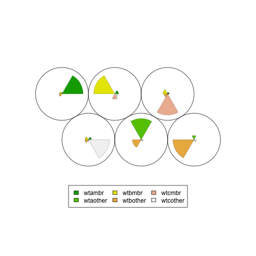 

Clusters help define PCA clustering
========================================================

 

***
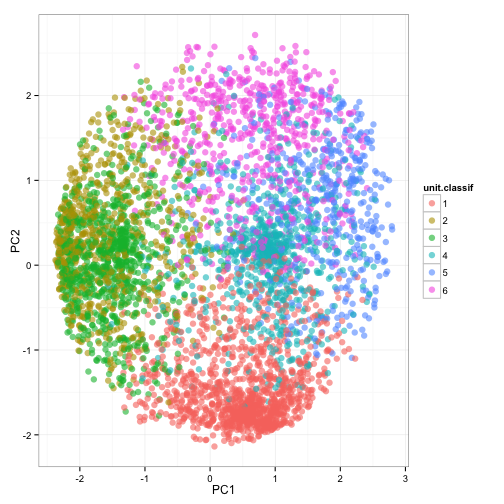 

=================================

</br></br>
</br></br>
**Question 1**: What genes define these clusters? Does clustering give similar GO enrichment results to DE analysis?

Cluster 2 
========================================================

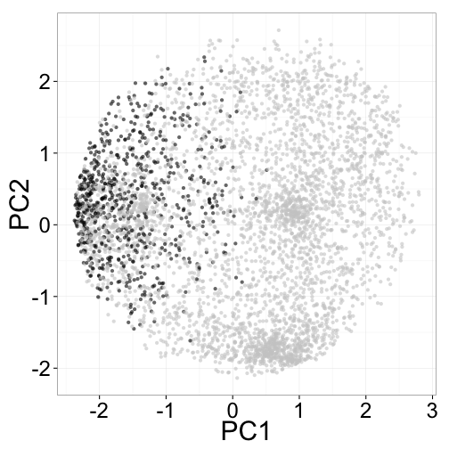 

Cluster 2 - Genes that are up-regulated in top rachis
========================================================
left:30%

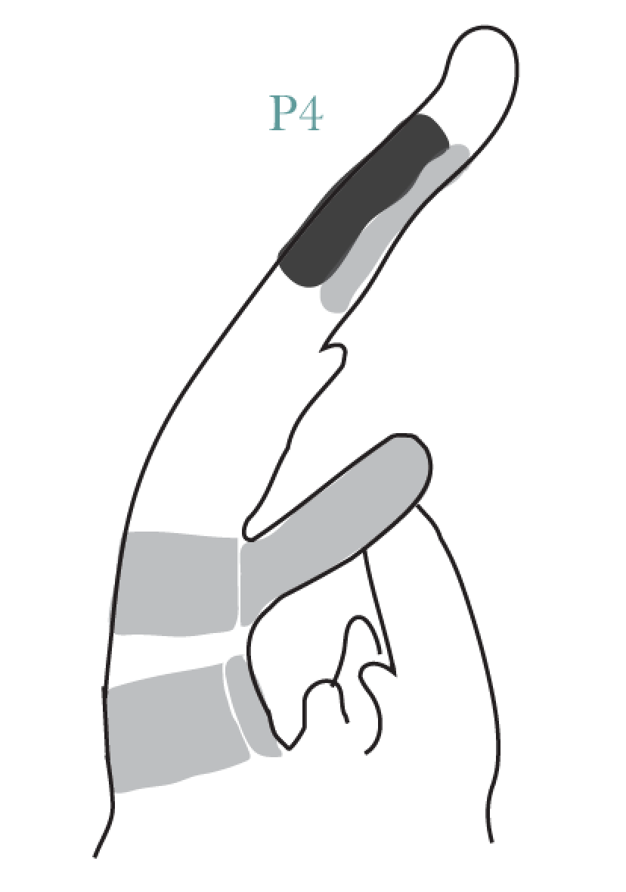

***
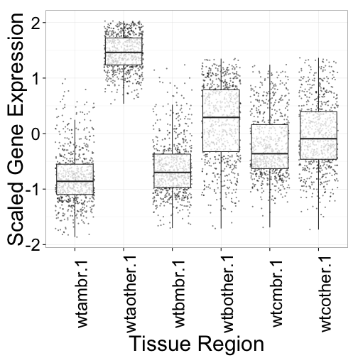 

Cluster 2 - Photosynthetic GO categories
========================================================


***


**Question 1**: Does clustering give similar GO enrichment 
results to DE analysis?

Yes. Recapitulates DE expression patterns in tissue 
specific regions.

**GO Categories**
- heme binding                   
- oxygen binding                  
- photosynthesis, light harvesting
- apoptotic process  


========================================================

<center></center>

***
</br></br>

**Question 2:** What are the specifc genes that contribute to marginal idenity?

**Approach:** Make a larger self organizing map allowing clusters that can specify regulated genes across multiple tissue types. 

Self Organizing Maps - Allow 36 clusters
========================================================
left: 60%
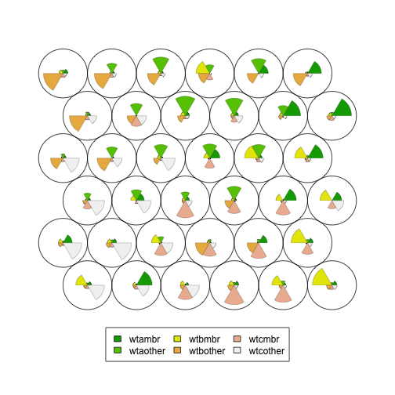 

***


Cluster 17 Up-regulated in rachis compared to margin 
========================================================
left: 30%


***

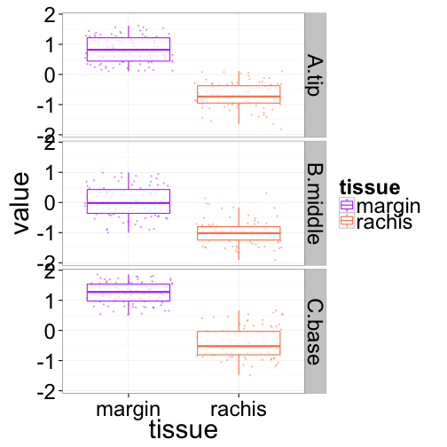 
 

Cluster 17: Growth Genes
========================================================
left: 80%

<small>Auxin Response 6 - auxin response via expression of auxin regulated genes

gibberellin 2-oxidase - responsive to cytokinin and KNOX activities

ARGONAUTE7 - required for mediolateral expansion in maize (Douglas et al, 2010)

REDUCED STEM BRANCHING 6 - MADS-box transcription factor, mutant flower margins expanded (TAIR mutant lines)

AP2/B3 domain transcription factor - may function as a negative growth regulator

R2R3-MYB TF factor gene -  MYB gene involved in cell fate idenity & Lateral Meristem Initiation (Muller et al., 2005)

EMBRYO DEFECTIVE - mutant with enlarged SAM (Cushing et al. 2005)</small>

Cluster 35
========================================================
left: 30%


***

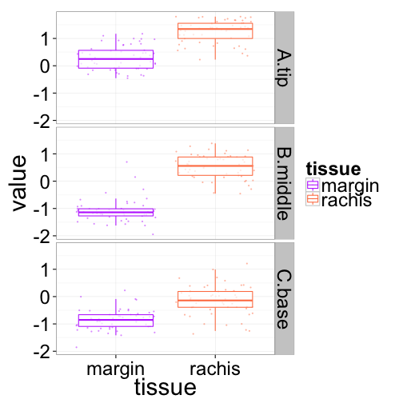 

Cluster 35 - Photosynthesis and Vascular Differentiation
========================================================
<small>**Solyc00g277510** - Encodes chlorophyll binding protein D1, a part of the photosystem II reaction center core

**Solyc02g071000** - Subunit of light-harvesting complex II (LHCII),which absorbs light and transfers energy to the photosynthetic reaction center.

**Solyc05g013570** - phototropic-responsive NPH3 family protein

**Solyc05g041230** - chloroplast gene encoding a CP43 subunit of  the photosystem II reaction center.

**Solyc08g066500** - Member of the class III HD-ZIP protein family. Critical for vascular development.

**Solyc08g067330** - Encodes lhcb1.1 a component of the LHCIIb light harvesting complex associated with photosystem II.</small>

Further investigation using mutant with accelerated cellular differentiation
========================================================

The trifoliate mutant is unable to make leaflets in rachis.
========================================================

<center>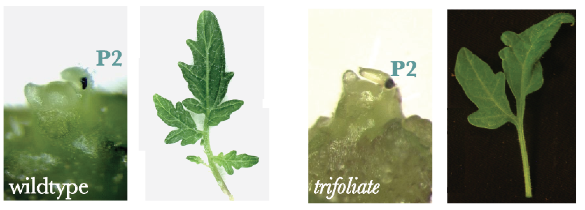</center>
*trifoliate* mutant is unable to make leaflets in response to exogenous
auxin applications, indicating lack of competence in the 
primordium.

The TF-2 gene is required to maintain morphogenetic potential.


Basic Vs. Super Self Organized Maps
========================================================
</br></br>
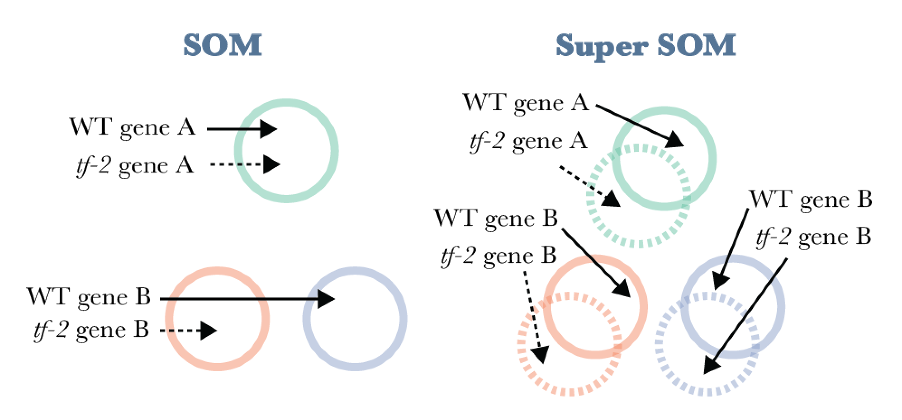

Basic SOM Small - Rachis & Tip up-regulated genes
========================================================
left:30%


***


```
Error in eval(expr, envir, enclos) : object 'ssom.unit.classif' not found
```
