Patterns of Gene Expression in Early Developing Complex Leaves
========================================================
author: Ciera Martinez
date: October 18, 2014
font-family: 'Baskerville'
css:cieraSlides.css
transition: fade
width: 1440
height: 700

Background
========================================================
title: FALSE

  

Background
========================================================
title: False

  

Background
========================================================
left: 60%
title: false

  
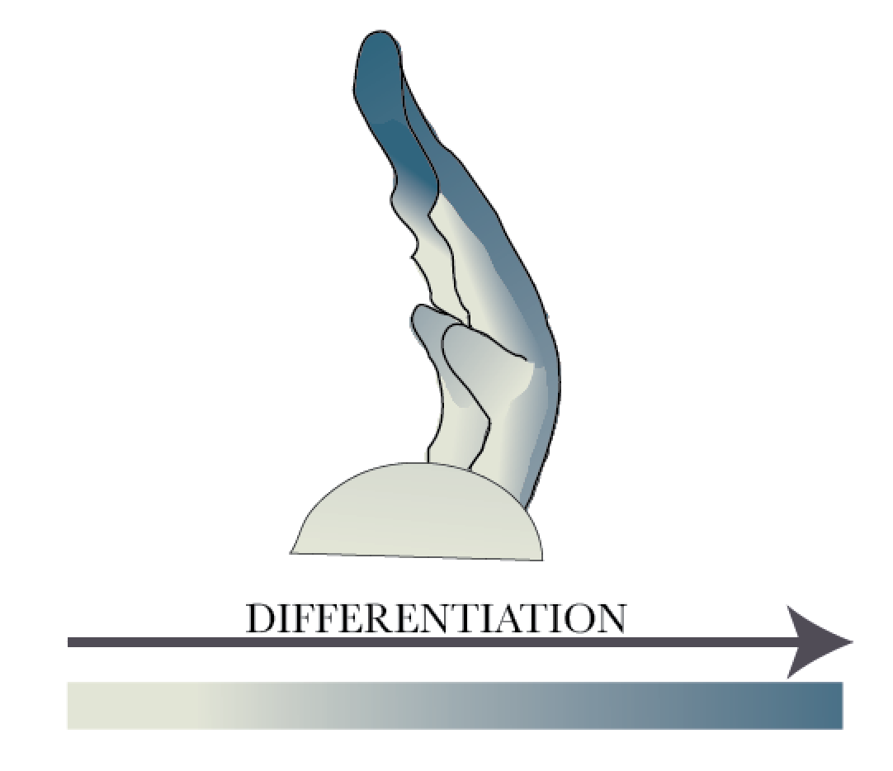

***
  
**Pattern 1**: Tip to base wave of differentiation.  
Cell differentation occurring first at the tip.

Background
========================================================
left: 60%
title: false

  

***
  
**Pattern 1**: Tip to base wave of differentiation.  
Cell differentation occurring first at the tip.

**Pattern 2**: Midrib to Marginal  blastozone or marginal meristem  
(defined histologically as having dense cells and 
maintenance of high rates of cell division)

Background
========================================================
left: 60%
title: false

  

***
  
**Pattern 1**: Tip to base wave of differentiation.  
Cell differentation occurring first at the tip.

**Pattern 2**: Midrib to Marginal  blastozone or marginal meristem  
(defined histologically as having dense cells and 
maintenance of high rates of cell division)

Main Question
========================================================
  
What are the genes expression trends observed in early complex leaf 
development that would explain differentiation patterning in the leaf?

Approach 
========================================================
left: 60%

***
Isolate tissue 

**1**. longitudinal 
axis (tip, mid, base)

**2**. margins compared with all other tissue 
(rachis  and midvein) regions, to perform gene expression analysis.

Laser Capture Microdissection
========================================================

<video width="1000" controls="controls">
<source src="movies/LCMmovie.m4v" type="video/mp4">
</video>

Differential Expression (DE) & GO enrichment
========================================================

DE & GO enrichment
========================================================
left: 70%

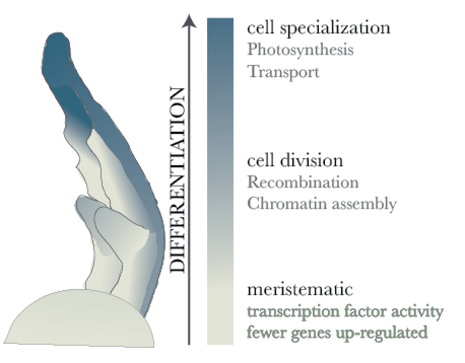

***

  
**Conclusion**

The regions further along in development
 will have up-regulation of GO categories 
 associated with differentiated tissue. 

Photosynthetic Activity
========================================================

Photosynthetic Activity
========================================================
left: 30%

***

It is unknown when and where photosynthetic activity is first evident in early developing leaves.

Photosynthetic Activity
========================================================
left: 30%

***

**Approach**: Chlorophyll a/b binding protein (CAB)::GUS  
localization reflects photosynthetic activity.

Photosynthetic Activity
========================================================
left: 30%

***

**Approach**: Chlorophyll a/b binding protein (CAB)::GUS  
localization reflects photosynthetic activity.

Ubiquitous in mature leaves.  

Photosynthetic Activity
========================================================
left: 30%

***

**Approach**: Chlorophyll a/b binding protein (CAB)::GUS  
localization reflects photosynthetic activity.

Ubiquitous in mature leaves. 

Where does CAB localize early in leaf development?

Photosynthetic Activity
========================================================

Photosynthetic Activity
========================================================
 
**Conclusions 1**: Early in leaf development (P4 & P5), the rachis 
and midviein show CAB activity, suggesting these regions are
first to start specialized processes such as photosynthesis. 

**Conclustion 2**: The LCM approach for determining gene expression 
patterns is capable of predicting verifiable expression patterns.

Co-expression Analysis 
========================================================

***

**Question 1**: Does clustering give similar GO enrichment 
results  to DE analysis?

**Question 2**: Are there patterns of gene expression that 
explain margin/rachis identity?

**Question 3**:  Can we get to smaller subset of genes that 
may explain differentiation patterning during leaf development?

Principle Component Analysis
========================================================
left: 50%

 

PC1 (29.2%)  

PC2 (20.8%) 
***
 
 
PC3 (20.3%) 

PC4 (15.6%)

Self Organizing Maps  
=======================================================
left: 80% 
  
  
<H2>Groups objects based on categories that define them.</H2> 

Self Organizing Maps  
=======================================================
left: 80% 

Self Organizing Maps: Limit to six clusters
========================================================

***

 

Clusters help define PCA clustering
========================================================

 

***
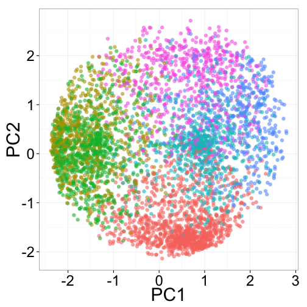 

=================================

  
  
**Question 1**: What genes define these clusters? Does clustering give similar GO enrichment results to DE analysis?

Cluster 2
========================================================

 

Cluster 2 - Genes that are up-regulated in top midvein 
========================================================
left:30%

***
 

Cluster 2 - Photosynthetic GO categories
========================================================

***

**Question 1**: Does clustering give similar GO enrichment 
results to DE analysis?

**GO Categories**
- heme binding                   
- oxygen binding                  
- photosynthesis, light harvesting
- apoptotic process  

Yes. Recapitulates DE expression patterns in tissue 
specific regions.

========================================================

***
  

**Question 2:** What are the specifc genes that contribute to marginal idenity?

**Approach:** Make a larger self organizing map allowing clusters that can specify regulated genes across multiple tissue types. 

Self Organizing Maps - Allow 36 clusters
========================================================
left: 60%
 

***

Cluster 17 Up-regulated in rachis compared to margin 
========================================================
left: 30%

***

 
 

Cluster 17: Growth Genes
========================================================
left: 80%

<small>Auxin Response 6 - auxin response via expression of auxin regulated genes

gibberellin 2-oxidase - responsive to cytokinin and KNOX activities

ARGONAUTE7 - required for mediolateral expansion in maize (Douglas et al, 2010)

REDUCED STEM BRANCHING 6 - MADS-box transcription factor, mutant flower margins expanded (TAIR mutant lines)

AP2/B3 domain transcription factor - may function as a negative growth regulator

R2R3-MYB TF factor gene -  MYB gene involved in cell fate idenity & Lateral Meristem Initiation (Muller et al., 2005)

EMBRYO DEFECTIVE - mutant with enlarged SAM (Cushing et al. 2005)</small>

Cluster 35
========================================================
left: 30%

***

 

Cluster 35 - Photosynthesis and Vascular Differentiation
========================================================
<small>**Solyc00g277510** - Encodes chlorophyll binding protein D1, a part of the photosystem II reaction center core

**Solyc02g071000** - Subunit of light-harvesting complex II (LHCII),which absorbs light and transfers energy to the photosynthetic reaction center.

**Solyc05g013570** - phototropic-responsive NPH3 family protein

**Solyc05g041230** - chloroplast gene encoding a CP43 subunit of  the photosystem II reaction center.

**Solyc08g066500** - Member of the class III HD-ZIP protein family. Critical for vascular development.

**Solyc08g067330** - Encodes lhcb1.1 a component of the LHCIIb light harvesting complex associated with photosystem II.</small>

 trifoliate (tf-2) mutant 
========================================================
left: 60%

***
 
The *TF-2* gene is required to maintain morphogenetic potential 
<small>(PNAS, Naz et al., 2013)</small>.

trifoliate mutant 
========================================================
left: 60%

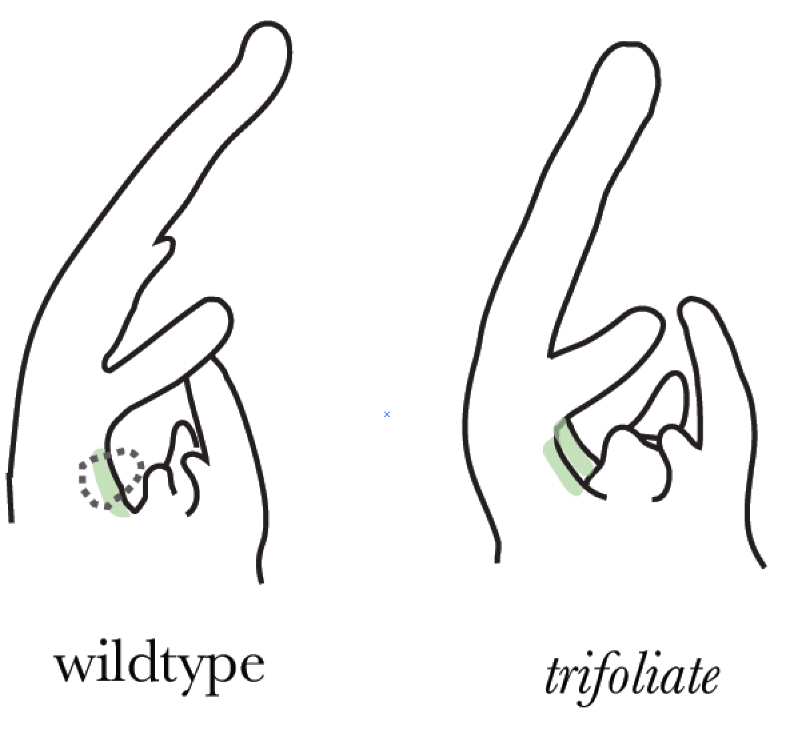

***

Marginal Blastozone in trifoliate cannot make new leaflets at P4 stage.

Comparisons with wildtype will help isolate genes involved in regulation of morphogenetic potential.

Super Self Organized Maps (superSOM)
========================================================
  
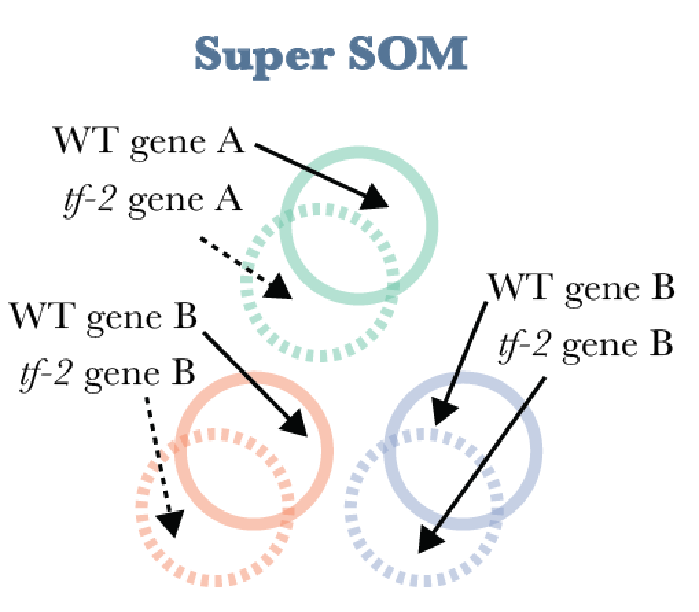

***
  
Super SOM: clusters have dimensionality and a separate 
identity associated with genotype data set, but ultimately, 
data must be assigned to the same cluster.

SuperSOM - Cluster 12
========================================================
left: 20%
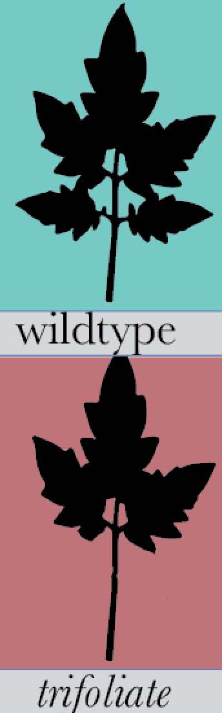

***

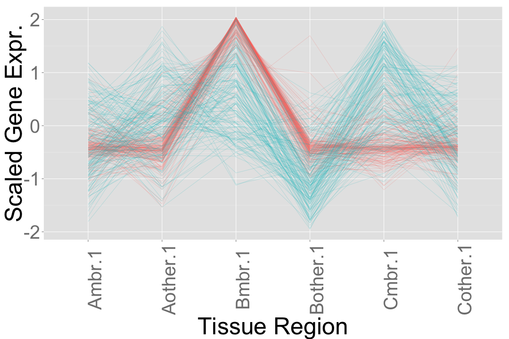 

SuperSOM - Cluster 12
========================================================

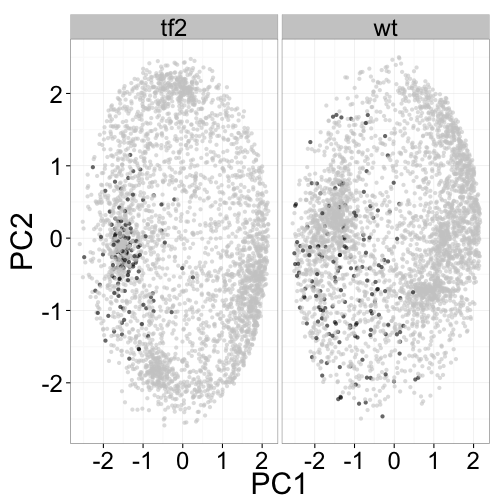 

***

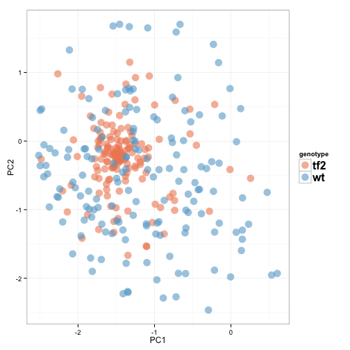 

SuperSOM - Cluster 12
========================================================

<H3>Auxin Regulation and Transport</H3>

**Solyc12g006340.1.1 (ARF8)**:Encodes a member of the auxin response factor family.

**Solyc10g076790.1.1 (AUX1)**:  Encodes an auxin influx transporter.

**Solyc03g118740.2.1 (PIN1)**: Auxin efflux.

SuperSOM - Cluster 12
========================================================

<H3>Developmental Transciption Factors</H3>

**Solyc09g065820.2.1**:  DNA binding / transcription factor; cell differentiation.

**Solyc09g010780.2.1**:  Involved in leaf development. Knockout mutants have abnormally shaped leaves.

**Solyc02g080260.2.1**: Encodes a homeodomain protein that is expressed in the LI layer of the vegetative

**Solyc07g018290.2.1 (PLETHERA 1)**: expressed in young tissues and may specify meristematic or division-competent states. (Wilson et al., 2005).

**Solyc06g075850.1.1**: Histone H4 : cytochrome P450 monooxygenase. Expressed in cotyledons and leaves

**Solyc04g009950.2.1**: R2R3- type MYB- encoding genes

SuperSOM - Cluster 28
========================================================
left: 20%

***

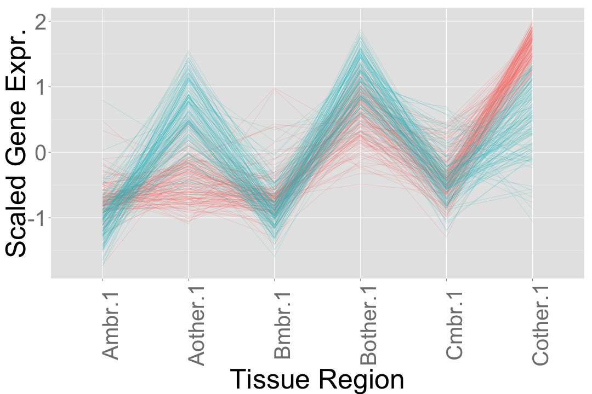 

SuperSOM - Cluster 28
========================================================

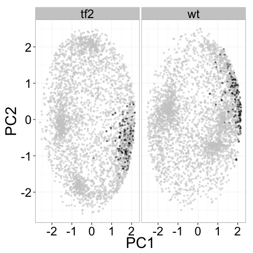 

***

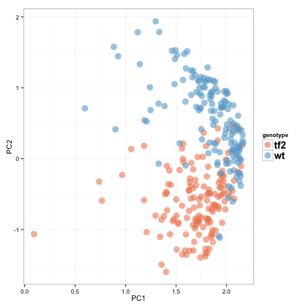 

Conclusions
========================================================
1. There are GO categories associated with different levels 
of cell differentiation.

2. There are groups of genes that define marginal blastozone along 
longitudinal axis, which include both known regulators and unknown genes.

Future
========================================================

- Combine all these interesting developmental clusters. 

- Combining both data from this study and other RNAseq leaf data. Network analysis to identify major hubs of developmental regulation.

- Functional analysis. 

Acknowlegements
========================================================
  

<H2>Thanks</H2>

Sinha Lab

*Brad Townsley

Harada Lab
 

***

  

<H2>Funding</H2>

NSF GRFP Fellowship

Elsie Taylor Stocking Fellowship

Walter R. and Roselinde H. Russell Fellowship

Collaborative Coding
=========================================

<H2>On Github:</H2>

-Scripts

-Normalized Data

-Tools for SOM cluster visualization

@iamciera on Github.

Coding Collective
=========================================
left:70%

Collaboratively learn to program.

All programing languages.  

All skill levels.

Learn faster, code together.

<H2>4-6pm (in LSA 2002)</H2>

<H2>github.com/theCodingCollective</H2>

***

